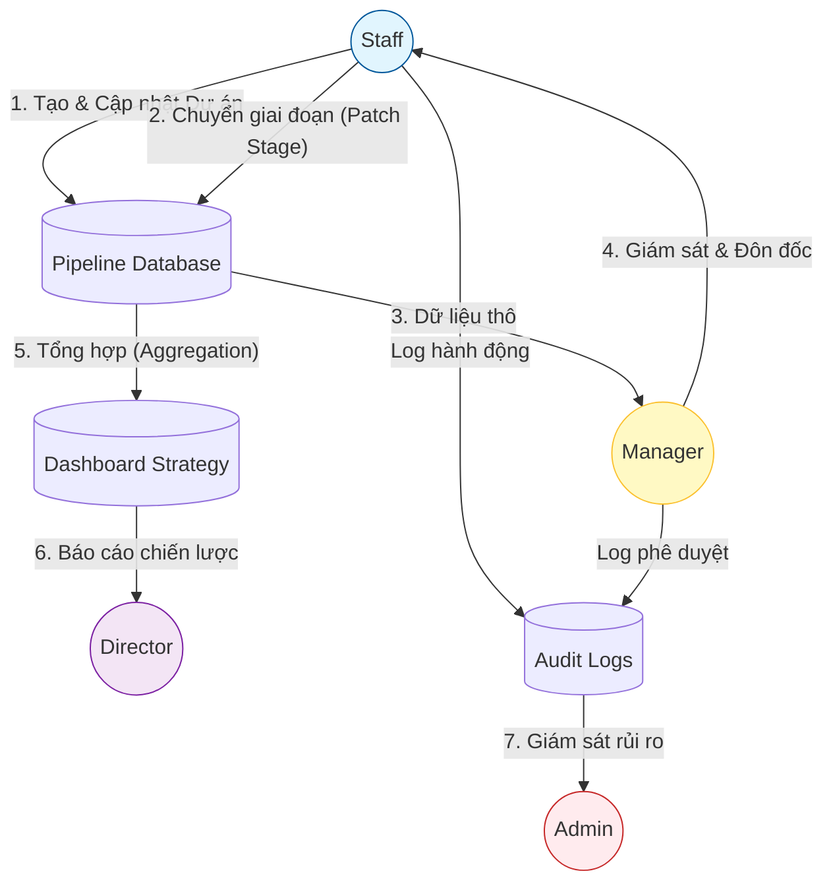

# Phân tích Tương tác Đa vai trò & Luồng Dữ liệu Hệ thống (IPA Cross-role Interaction)

Báo cáo này phân tích cách các vai trò **Staff, Manager, Director** và **Admin** phối hợp với nhau để vận hành hệ thống Xúc tiến Đầu tư (IPA), từ dữ liệu tác vụ thô đến các quyết định chiến lược vĩ mô.

---

## 1. Sơ đồ Luồng Dự án (Pipeline Data Flow)

Dưới đây là hành trình của một dự án FDI trong hệ thống, minh họa cách dữ liệu di chuyển từ cấp chuyên viên đến lãnh đạo cao nhất.

### Phân tích Luồng:
1.  **Staff (Điểm đầu):** Là người "nuôi dưỡng" dữ liệu. Mọi thay đổi về giai đoạn dự án (`patchStage`) ngay lập tức cập nhật vào Database.
2.  **Manager (Trung gian):** Không can thiệp trực tiếp vào từng dự án nhưng sử dụng `Unit Reports` để kiểm soát xem Team có đang đi đúng hướng không.
3.  **Director (Điểm cuối):** Tiếp nhận dữ liệu đã được lọc nhiễu qua `Dashboard Summary`. Ví dụ: Director không cần biết dự án A do ai làm, họ chỉ cần thấy "Tổng giá trị 500M USD" trong stage `Negotiation`.

---

## 2. Hệ thống Thông báo (Notification Bridge)

Thông báo đóng vai trò là "chất xúc tác" đảm bảo hệ thống không bị tắc nghẽn. Cầu nối này liên kết các vai trò theo thời gian thực.

| Luồng tương tác | Sự kiện kích hoạt | Vai trò nhận thông báo | Hành động tiếp theo |
| :--- | :--- | :--- | :--- |
| **Pê duyệt** | Staff tạo yêu cầu (Minutes/Delegation) | Manager | Click thông báo -> Mở `ApprovalsPage` để duyệt |
| **Tiến độ** | Manager phê duyệt/từ chối | Staff | Click thông báo -> Cập nhật hồ sơ (nếu bị từ chối) |
| **Chiến lược** | Báo cáo định kỳ được hệ thống tạo xong | Director | Click thông báo -> Xem `CityReportsPage` |
| **Bảo mật** | Có hành vi bất thường/Xóa dữ liệu | Admin | Click thông báo -> Truy vết trong `AuditLogPage` |

> [!TIP]
> **UX Insight:** Hệ thống sử dụng `unreadCount` để tạo áp lực số lượng (Red dot psychology), thúc đẩy các vai trò xử lý tồn đọng nhanh hơn.

---

## 3. Chu trình Phê duyệt (The Approval Loop)

Đây là tương tác chặt chẽ nhất giữa **Staff** và **Manager**.

1.  **Giai đoạn Request:** Staff nhập liệu dự án/đoàn công tác. Hệ thống tự động tạo một bản ghi `ApprovalItem` với trạng thái `PENDING`.
2.  **Giai đoạn Decision:** Manager xem danh sách `approvalsApi.list`. 
    *   Nếu **Approve**: Dữ liệu dự án chính thức được "khóa" hoặc chuyển trạng thái.
    *   Nếu **Reject**: Manager **bắt buộc** nhập `decisionNote`. Nhân viên sẽ nhận được Feedback ngay lập tức.
3.  **Giai đoạn Audit:** Mọi quyết định của Manager đều được `auditLogsApi` ghi lại, Admin có thể kiểm tra nếu có khiếu nại hoặc sai sót.

---

## 4. Hệ sinh thái Báo cáo (Reporting Ecosystem)

Sự chuyển hóa từ Tác vụ (Task) thành Chiến lược (KPI):

*   **Tầng 1 (Staff):** Hoàn thành Task -> Đạt mốc dự án (Milestone).
*   **Tầng 2 (Manager):** Tổng hợp Task hoàn thành của Team trong tháng -> Chỉ số hiệu suất đơn vị (Unit KPI %).
*   **Tầng 3 (Director):** Tổng hợp dữ liệu từ tất cả các đơn vị -> Bản đồ vốn FDI của Thành phố và Dự báo (Forecasting).

---

## Đánh giá Tổng thể từ Persona Lãnh đạo cao cấp:

Hệ thống IPA đã đạt được sự **"Cộng sinh Dữ liệu" (Data Symbiosis)**. 
- **Staff** không cảm thấy mình chỉ "nhập máy móc" vì họ thấy được task của mình đóng góp vào KPI phòng.
- **Manager** có đủ công cụ để quản trị mà không cần "cầm tay chỉ việc".
- **Director** có đủ sự tin cậy vào số liệu vì mọi thứ đều có vết (Audit log) và qua các bước kiểm duyệt (Approval).

> [!IMPORTANT]
> **Kết luận:** Tương tác đa vai trò trong IPA không chỉ là việc chia sẻ dữ liệu, mà là một **Logic Vận hành** được thiết kế để tối ưu hóa dòng vốn đầu tư và đảm bảo tính minh bạch trong quản lý công.
